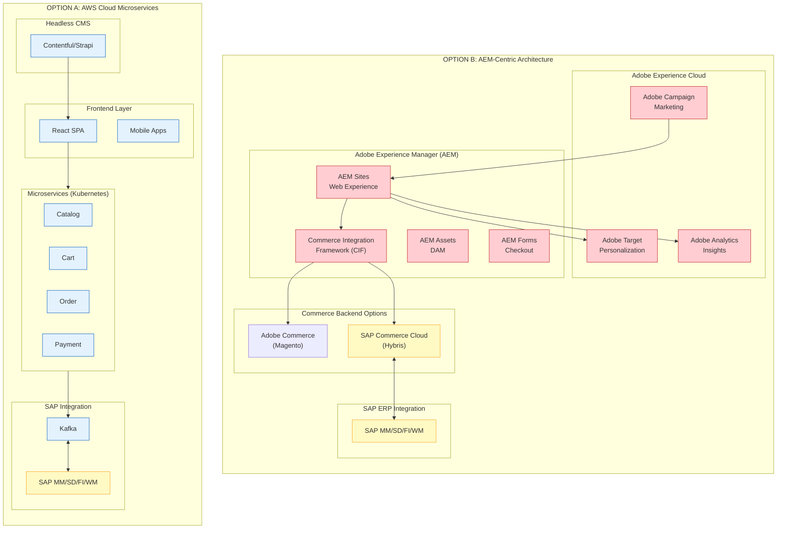

```mermaid
flowchart TB
    subgraph OPTION_A["OPTION B: AEM-Centric Architecture"]
        direction TB
        
        subgraph AEM_LAYER["Adobe Experience Manager (AEM)"]
            AEM_SITES["AEM Sites<br/>Web Experience"]
            AEM_ASSETS["AEM Assets<br/>DAM"]
            AEM_CIF["Commerce Integration<br/>Framework (CIF)"]
            AEM_FORMS["AEM Forms<br/>Checkout"]
        end
        
        subgraph ADOBE_CLOUD["Adobe Experience Cloud"]
            TARGET["Adobe Target<br/>Personalization"]
            ANALYTICS["Adobe Analytics<br/>Insights"]
            CAMPAIGN["Adobe Campaign<br/>Marketing"]
        end
        
        subgraph AEM_COMMERCE["Commerce Backend Options"]
            MAGENTO["Adobe Commerce<br/>(Magento)"]
            SAP_HYBRIS["SAP Commerce Cloud<br/>(Hybris)"]
        end
        
        subgraph AEM_SAP["SAP ERP Integration"]
            SAP_ERP_A["SAP MM/SD/FI/WM"]
        end
        
        AEM_SITES --> AEM_CIF
        AEM_CIF --> MAGENTO
        AEM_CIF --> SAP_HYBRIS
        SAP_HYBRIS <--> SAP_ERP_A
        AEM_SITES --> TARGET
        AEM_SITES --> ANALYTICS
        CAMPAIGN --> AEM_SITES
    end
    
    subgraph OPTION_B["OPTION A: AWS Cloud Microservices"]
        direction TB
        
        subgraph CN_FRONTEND["Frontend Layer"]
            REACT["React SPA"]
            MOBILE_APP["Mobile Apps"]
        end
        
        subgraph CN_SERVICES["Microservices (Kubernetes)"]
            CATALOG["Catalog"]
            CART["Cart"]
            ORDER["Order"]
            PAYMENT["Payment"]
        end
        
        subgraph CN_CMS["Headless CMS"]
            CONTENTFUL["Contentful/Strapi"]
        end
        
        subgraph CN_SAP["SAP Integration"]
            KAFKA["Kafka"]
            SAP_ERP_B["SAP MM/SD/FI/WM"]
        end
        
        REACT --> CN_SERVICES
        CN_SERVICES --> KAFKA
        KAFKA <--> SAP_ERP_B
        CONTENTFUL --> REACT
    end

    classDef aem fill:#FFCDD2,stroke:#C62828
    classDef cloud fill:#E3F2FD,stroke:#1565C0
    classDef sap fill:#FFF9C4,stroke:#F9A825

    class AEM_SITES,AEM_ASSETS,AEM_CIF,AEM_FORMS,TARGET,ANALYTICS,CAMPAIGN aem
    class REACT,MOBILE_APP,CATALOG,CART,ORDER,PAYMENT,PERSONALIZATION,CONTENTFUL,KAFKA cloud
    class SAP_ERP_A,SAP_ERP_B,SAP_HYBRIS sap
```
