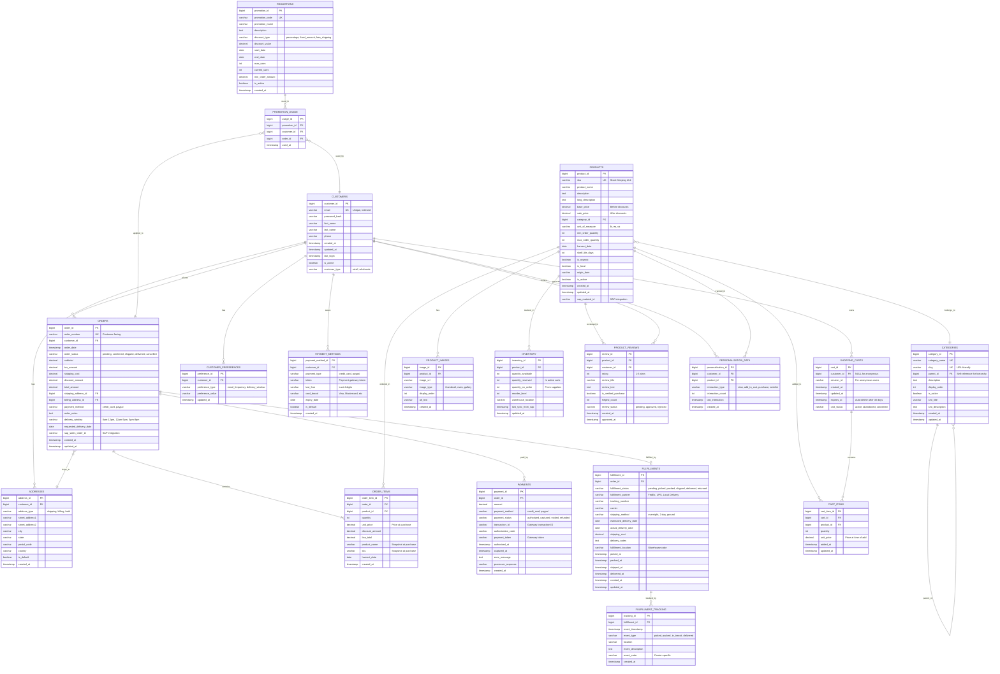

```mermaid
erDiagram
    CUSTOMERS ||--o{ ADDRESSES : "has"
    CUSTOMERS ||--o{ ORDERS : "places"
    CUSTOMERS ||--o{ SHOPPING_CARTS : "owns"
    CUSTOMERS ||--o{ CUSTOMER_PREFERENCES : "has"
    CUSTOMERS ||--o{ PAYMENT_METHODS : "saves"
    
    ORDERS ||--|{ ORDER_ITEMS : "contains"
    ORDERS ||--o{ PAYMENTS : "paid_by"
    ORDERS ||--o| FULFILLMENTS : "fulfilled_by"
    ORDERS }o--|| ADDRESSES : "ships_to"
    
    PRODUCTS ||--o{ ORDER_ITEMS : "ordered_in"
    PRODUCTS ||--o{ CART_ITEMS : "added_to"
    PRODUCTS }o--|| CATEGORIES : "belongs_to"
    PRODUCTS ||--o{ PRODUCT_IMAGES : "has"
    PRODUCTS ||--o{ INVENTORY : "tracked_in"
    
    SHOPPING_CARTS ||--o{ CART_ITEMS : "contains"
    
    CATEGORIES ||--o{ CATEGORIES : "parent_of"
    
    FULFILLMENTS ||--o{ FULFILLMENT_TRACKING : "tracked_by"

    CUSTOMERS {
        bigint customer_id PK
        varchar email UK "Unique, indexed"
        varchar password_hash
        varchar first_name
        varchar last_name
        varchar phone
        timestamp created_at
        timestamp updated_at
        timestamp last_login
        boolean is_active
        varchar customer_type "retail, wholesale"
    }
    
    ADDRESSES {
        bigint address_id PK
        bigint customer_id FK
        varchar address_type "shipping, billing, both"
        varchar street_address1
        varchar street_address2
        varchar city
        varchar state
        varchar postal_code
        varchar country
        boolean is_default
        timestamp created_at
    }
    
    CUSTOMER_PREFERENCES {
        bigint preference_id PK
        bigint customer_id FK
        varchar preference_type "email_frequency, delivery_window"
        varchar preference_value
        timestamp updated_at
    }
    
    PAYMENT_METHODS {
        bigint payment_method_id PK
        bigint customer_id FK
        varchar payment_type "credit_card, paypal"
        varchar token "Payment gateway token"
        varchar last_four "Last 4 digits"
        varchar card_brand "Visa, Mastercard, etc"
        date expiry_date
        boolean is_default
        timestamp created_at
    }
    
    CATEGORIES {
        bigint category_id PK
        varchar category_name UK
        varchar slug UK "URL-friendly"
        bigint parent_id FK "Self-reference for hierarchy"
        text description
        int display_order
        boolean is_active
        varchar seo_title
        text seo_description
        timestamp created_at
        timestamp updated_at
    }
    
    PRODUCTS {
        bigint product_id PK
        varchar sku UK "Stock Keeping Unit"
        varchar product_name
        text description
        text long_description
        decimal base_price "Before discounts"
        decimal sale_price "After discounts"
        bigint category_id FK
        varchar unit_of_measure "lb, ea, oz"
        int min_order_quantity
        int max_order_quantity
        date harvest_date
        int shelf_life_days
        boolean is_organic
        boolean is_local
        varchar origin_farm
        boolean is_active
        timestamp created_at
        timestamp updated_at
        varchar sap_material_id "SAP integration"
    }
    
    PRODUCT_IMAGES {
        bigint image_id PK
        bigint product_id FK
        varchar image_url
        varchar image_type "thumbnail, main, gallery"
        int display_order
        varchar alt_text
        timestamp created_at
    }
    
    INVENTORY {
        bigint inventory_id PK
        bigint product_id FK
        int quantity_available
        int quantity_reserved "In active carts"
        int quantity_on_order "From suppliers"
        int reorder_level
        varchar warehouse_location
        timestamp last_sync_from_sap
        timestamp updated_at
    }
    
    SHOPPING_CARTS {
        bigint cart_id PK
        bigint customer_id FK "NULL for anonymous"
        varchar session_id "For anonymous users"
        timestamp created_at
        timestamp updated_at
        timestamp expires_at "Auto-delete after 30 days"
        varchar cart_status "active, abandoned, converted"
    }
    
    CART_ITEMS {
        bigint cart_item_id PK
        bigint cart_id FK
        bigint product_id FK
        int quantity
        decimal unit_price "Price at time of add"
        timestamp added_at
        timestamp updated_at
    }
    
    ORDERS {
        bigint order_id PK
        varchar order_number UK "Customer-facing"
        bigint customer_id FK
        timestamp order_date
        varchar order_status "pending, confirmed, shipped, delivered, cancelled"
        decimal subtotal
        decimal tax_amount
        decimal shipping_cost
        decimal discount_amount
        decimal total_amount
        bigint shipping_address_id FK
        bigint billing_address_id FK
        varchar payment_method "credit_card, paypal"
        text order_notes
        varchar delivery_window "8am-12pm, 12pm-5pm, 5pm-8pm"
        date requested_delivery_date
        varchar sap_sales_order_id "SAP integration"
        timestamp created_at
        timestamp updated_at
    }
    
    ORDER_ITEMS {
        bigint order_item_id PK
        bigint order_id FK
        bigint product_id FK
        int quantity
        decimal unit_price "Price at purchase"
        decimal discount_amount
        decimal line_total
        varchar product_name "Snapshot at purchase"
        varchar sku "Snapshot at purchase"
        date harvest_date
        timestamp created_at
    }
    
    PAYMENTS {
        bigint payment_id PK
        bigint order_id FK
        decimal amount
        varchar payment_method "credit_card, paypal"
        varchar payment_status "authorized, captured, voided, refunded"
        varchar transaction_id "Gateway transaction ID"
        varchar authorization_code
        varchar payment_token "Gateway token"
        timestamp authorized_at
        timestamp captured_at
        text error_message
        varchar processor_response
        timestamp created_at
    }
    
    FULFILLMENTS {
        bigint fulfillment_id PK
        bigint order_id FK
        varchar fulfillment_status "pending, picked, packed, shipped, delivered, returned"
        varchar fulfillment_partner "FedEx, UPS, Local Delivery"
        varchar tracking_number
        varchar carrier
        varchar shipping_method "overnight, 2-day, ground"
        date estimated_delivery_date
        date actual_delivery_date
        decimal shipping_cost
        text delivery_notes
        varchar fulfillment_location "Warehouse code"
        timestamp picked_at
        timestamp packed_at
        timestamp shipped_at
        timestamp delivered_at
        timestamp created_at
        timestamp updated_at
    }
    
    FULFILLMENT_TRACKING {
        bigint tracking_id PK
        bigint fulfillment_id FK
        timestamp event_timestamp
        varchar event_type "picked, packed, in_transit, delivered"
        varchar location
        text event_description
        varchar event_code "Carrier-specific"
        timestamp created_at
    }
    
    PROMOTIONS {
        bigint promotion_id PK
        varchar promotion_code UK
        varchar promotion_name
        text description
        varchar discount_type "percentage, fixed_amount, free_shipping"
        decimal discount_value
        date start_date
        date end_date
        int max_uses
        int current_uses
        decimal min_order_amount
        boolean is_active
        timestamp created_at
    }
    
    PROMOTION_USAGE {
        bigint usage_id PK
        bigint promotion_id FK
        bigint customer_id FK
        bigint order_id FK
        timestamp used_at
    }
    
    PRODUCT_REVIEWS {
        bigint review_id PK
        bigint product_id FK
        bigint customer_id FK
        int rating "1-5 stars"
        varchar review_title
        text review_text
        boolean is_verified_purchase
        int helpful_count
        varchar review_status "pending, approved, rejected"
        timestamp created_at
        timestamp approved_at
    }
    
    PERSONALIZATION_DATA {
        bigint personalization_id PK
        bigint customer_id FK
        bigint product_id FK
        varchar interaction_type "view, add_to_cart, purchase, wishlist"
        int interaction_count
        timestamp last_interaction
        timestamp created_at
    }

    PROMOTIONS ||--o{ PROMOTION_USAGE : "used_in"
    PROMOTION_USAGE }o--|| CUSTOMERS : "used_by"
    PROMOTION_USAGE }o--|| ORDERS : "applied_to"
    
    PRODUCTS ||--o{ PRODUCT_REVIEWS : "reviewed_in"
    CUSTOMERS ||--o{ PRODUCT_REVIEWS : "writes"
    
    CUSTOMERS ||--o{ PERSONALIZATION_DATA : "generates"
    PRODUCTS ||--o{ PERSONALIZATION_DATA : "tracked_in"
```
