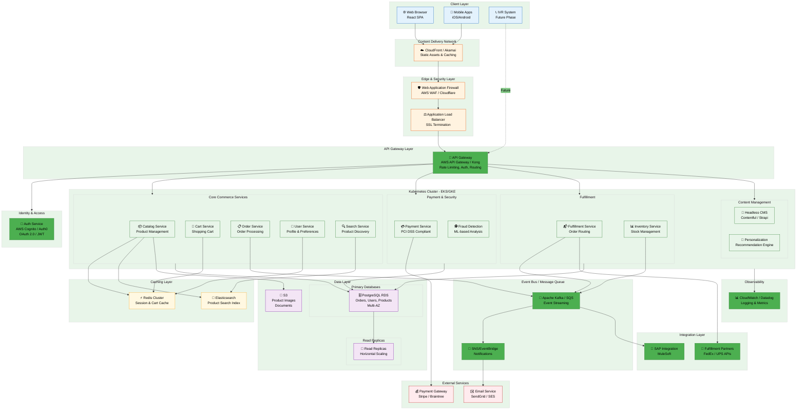

```mermaid
%%{init: {'theme': 'base', 'themeVariables': { 'primaryColor': '#4CAF50', 'primaryTextColor': '#000000', 'primaryBorderColor': '#2E7D32', 'lineColor': '#333', 'secondaryColor': '#81C784', 'tertiaryColor': '#E8F5E9'}}}%%
flowchart TB
    subgraph CLIENTS["Client Layer"]
        WEB["🌐 Web Browser<br/>React SPA"]
        MOBILE["📱 Mobile Apps<br/>iOS/Android"]
        IVR["📞 IVR System<br/>Future Phase"]
    end

    subgraph CDN["Content Delivery Network"]
        CF["☁️ CloudFront / Akamai<br/>Static Assets & Caching"]
    end

    subgraph EDGE["Edge & Security Layer"]
        WAF["🛡️ Web Application Firewall<br/>AWS WAF / Cloudflare"]
        ALB["⚖️ Application Load Balancer<br/>SSL Termination"]
    end

    subgraph API["API Gateway Layer"]
        APIGW["🚪 API Gateway<br/>AWS API Gateway / Kong<br/>Rate Limiting, Auth, Routing"]
    end

    subgraph AUTH["Identity & Access"]
        COGNITO["🔐 Auth Service<br/>AWS Cognito / Auth0<br/>OAuth 2.0 / JWT"]
    end

    subgraph K8S["Kubernetes Cluster - EKS/GKE"]
        subgraph CORE["Core Commerce Services"]
            CATALOG["📦 Catalog Service<br/>Product Management"]
            CART["🛒 Cart Service<br/>Shopping Cart"]
            ORDER["📋 Order Service<br/>Order Processing"]
            USER["👤 User Service<br/>Profile & Preferences"]
            SEARCH["🔍 Search Service<br/>Product Discovery"]
        end
        
        subgraph PAYMENT["Payment & Security"]
            PAY["💳 Payment Service<br/>PCI DSS Compliant"]
            FRAUD["🕵️ Fraud Detection<br/>ML-based Analysis"]
        end
        
        subgraph FULFILL["Fulfillment"]
            FULFILL_SVC["📬 Fulfillment Service<br/>Order Routing"]
            INVENTORY["📊 Inventory Service<br/>Stock Management"]
        end
        
        subgraph CMS["Content Management"]
            HEADLESS["📝 Headless CMS<br/>Contentful / Strapi"]
            PERSONALIZE["🎯 Personalization<br/>Recommendation Engine"]
        end
    end

    subgraph MESSAGING["Event Bus / Message Queue"]
        KAFKA["📨 Apache Kafka / SQS<br/>Event Streaming"]
        SNS["📢 SNS/EventBridge<br/>Notifications"]
    end

    subgraph CACHE["Caching Layer"]
        REDIS["⚡ Redis Cluster<br/>Session & Cart Cache"]
        ELASTIC["🔎 Elasticsearch<br/>Product Search Index"]
    end

    subgraph DATA["Data Layer"]
        subgraph PRIMARY["Primary Databases"]
            RDS["🗄️ PostgreSQL RDS<br/>Orders, Users, Products<br/>Multi-AZ"]
        end
        subgraph REPLICA["Read Replicas"]
            RDS_READ["📖 Read Replicas<br/>Horizontal Scaling"]
        end
        S3["📁 S3<br/>Product Images<br/>Documents"]
    end

    subgraph INTEGRATION["Integration Layer"]
        SAP_INT["🔄 SAP Integration<br/>MuleSoft"]
        PARTNER["🚚 Fulfillment Partners<br/>FedEx / UPS APIs"]
    end

    subgraph EXTERNAL["External Services"]
        PAYMENT_GW["💰 Payment Gateway<br/>Stripe / Braintree"]
        EMAIL["✉️ Email Service<br/>SendGrid / SES"]
    end

    subgraph MONITORING["Observability"]
        LOGS["📊 CloudWatch / Datadog<br/>Logging & Metrics"]
    end

    %% Client connections
    WEB --> CF
    MOBILE --> CF
    IVR -.->|"Future"| APIGW
    CF --> WAF
    WAF --> ALB
    ALB --> APIGW

    %% API Gateway routing
    APIGW --> AUTH
    APIGW --> CORE
    APIGW --> PAYMENT
    APIGW --> FULFILL
    APIGW --> CMS

    %% Service to Cache connections
    CATALOG --> REDIS
    CATALOG --> ELASTIC
    CART --> REDIS
    SEARCH --> ELASTIC
    USER --> REDIS

    %% Service to Database
    CORE --> RDS
    PAYMENT --> RDS
    FULFILL --> RDS
    RDS --> RDS_READ
    CATALOG --> S3

    %% Event-driven connections
    ORDER --> KAFKA
    FULFILL_SVC --> KAFKA
    INVENTORY --> KAFKA
    KAFKA --> SNS

    %% Integration layer
    KAFKA --> SAP_INT
    FULFILL_SVC --> PARTNER

    %% External services
    PAY --> PAYMENT_GW
    SNS --> EMAIL

    %% Monitoring
    K8S --> LOGS

    classDef client fill:#E3F2FD,stroke:#1565C0
    classDef edge fill:#FFF3E0,stroke:#E65100
    classDef service fill:#E8F5E9,stroke:#2E7D32
    classDef data fill:#F3E5F5,stroke:#7B1FA2
    classDef external fill:#FFEBEE,stroke:#C62828
    classDef cache fill:#FFF8E1,stroke:#F9A825

    class WEB,MOBILE,IVR client
    class WAF,ALB,CF edge
    class CATALOG,CART,ORDER,USER,SEARCH,PAY,FRAUD,FULFILL_SVC,INVENTORY,HEADLESS,PERSONALIZE service
    class RDS,RDS_READ,S3 data
    class PAYMENT_GW,EMAIL,SMS external
    class REDIS,ELASTIC cache
```
