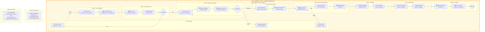

```mermaid
flowchart TB
    subgraph HYBRIS_WORKFLOW["SAP COMMERCE CLOUD - ORDER WORKFLOW<br/>(Native Hybris Process Engine)"]
        style HYBRIS_WORKFLOW fill:#FFF8E1,stroke:#FF8F00,stroke-width:3px
        
        Start((Start))
        
        subgraph Validate["Step 1: Cart Validation"]
            ValidateCart["🛒 Validate Cart<br/>Check items, stock, prices"]
            PriceCalc["💰 Calculate Totals<br/>Promotions, taxes, shipping"]
        end
        
        subgraph Inventory["Step 2: Inventory Check"]
            CheckATP["📊 ATP Check<br/>Available-to-Promise"]
            SAPInvCheck["🔄 SAP MM Query<br/>via Data Hub"]
            InvChoice{Available?}
        end
        
        subgraph Payment["Step 3: Payment Processing"]
            TokenizeCard["🔐 Tokenize Card<br/>Stripe.js / Cybersource"]
            AuthPayment["💳 Authorize Payment<br/>Payment Extension"]
            PaymentChoice{Authorized?}
            FraudCheck["🕵️ Fraud Screening<br/>Provider Rules"]
        end
        
        subgraph OrderCreate["Step 4: Order Creation"]
            CreateOrder["📋 Create Order<br/>Hybris Order Module"]
            AssignWarehouse["🏭 Assign Warehouse<br/>Sourcing Rules"]
        end
        
        subgraph SAPSync["Step 5: SAP Synchronization"]
            direction LR
            SendToSAP["📤 Send to SAP<br/>ORDERS05 IDoc"]
            CreateSalesOrder["📝 Create SD Order<br/>SAP Sales Order"]
            TriggerWM["📦 Trigger Picking<br/>SAP WM"]
        end
        
        subgraph Fulfillment["Step 6: Fulfillment"]
            RequestShipping["🚚 Request Shipping<br/>FedEx/UPS API"]
            GetTracking["🔢 Get Tracking #<br/>Carrier Response"]
        end
        
        subgraph Notification["Step 7: Notifications"]
            SendConfirmation["📧 Order Confirmation<br/>Adobe Campaign"]
            SendShipNotify["📧 Ship Notification<br/>Adobe Campaign"]
        end
        
        subgraph Complete["Step 8: Complete"]
            CapturePayment["💰 Capture Payment<br/>On Delivery"]
            PostToFI["📊 Post to SAP FI<br/>Revenue Recognition"]
            Success((Success))
        end
        
        subgraph Errors["Error Handling"]
            OutOfStock["❌ Out of Stock<br/>Backorder or Cancel"]
            PaymentFailed["❌ Payment Failed<br/>Retry / Alt Method"]
            SAPError["⚠️ SAP Error<br/>Queue for Retry"]
        end
    end
    
    Start --> ValidateCart
    ValidateCart --> PriceCalc
    PriceCalc --> CheckATP
    CheckATP --> SAPInvCheck
    SAPInvCheck --> InvChoice
    
    InvChoice -->|"Yes"| TokenizeCard
    InvChoice -->|"No"| OutOfStock
    
    TokenizeCard --> FraudCheck
    FraudCheck --> AuthPayment
    AuthPayment --> PaymentChoice
    
    PaymentChoice -->|"Success"| CreateOrder
    PaymentChoice -->|"Failed"| PaymentFailed
    
    CreateOrder --> AssignWarehouse
    AssignWarehouse --> SendToSAP
    
    SendToSAP --> CreateSalesOrder
    CreateSalesOrder --> TriggerWM
    SendToSAP -.->|"Error"| SAPError
    
    TriggerWM --> RequestShipping
    RequestShipping --> GetTracking
    GetTracking --> SendConfirmation
    
    SendConfirmation --> SendShipNotify
    SendShipNotify --> CapturePayment
    CapturePayment --> PostToFI
    PostToFI --> Success
    
    OutOfStock -.-> Start
    PaymentFailed -.-> TokenizeCard
    SAPError -.->|"Retry"| SendToSAP
    
    subgraph RETRY["Retry Configuration"]
        RetryConfig["Hybris Task Engine:<br/>• MaxRetries: 3<br/>• RetryDelay: 300s<br/>• Exponential Backoff"]
    end
    
    subgraph DATAHUB["Data Hub Config"]
        DataHubConfig["SAP Integration:<br/>• Sync Mode: Near Real-time<br/>• Error Queue: Yes<br/>• Monitoring: Dashboard"]
    end
```
